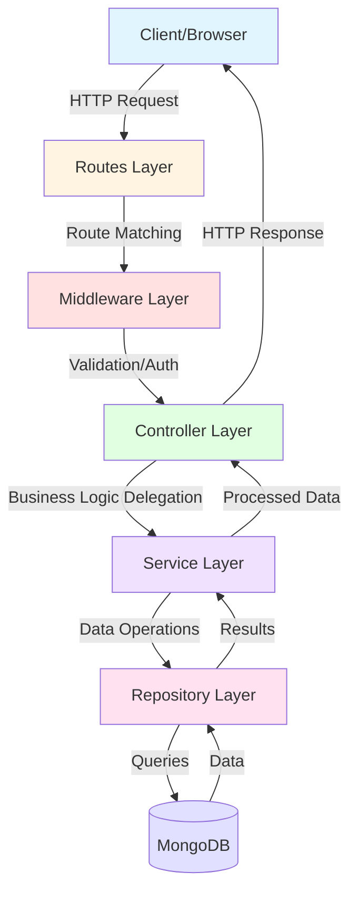
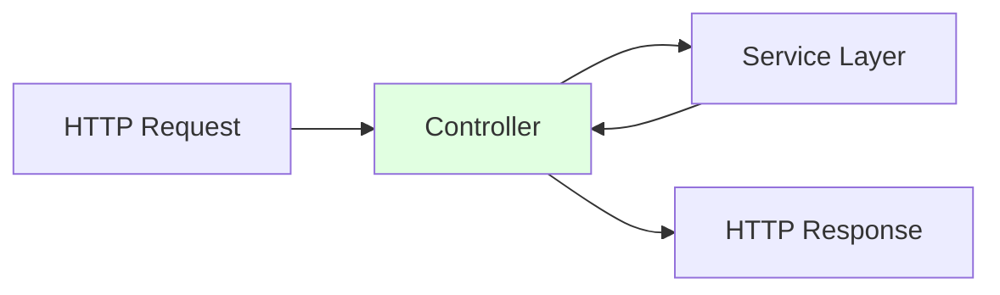
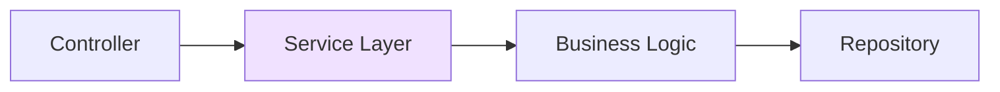
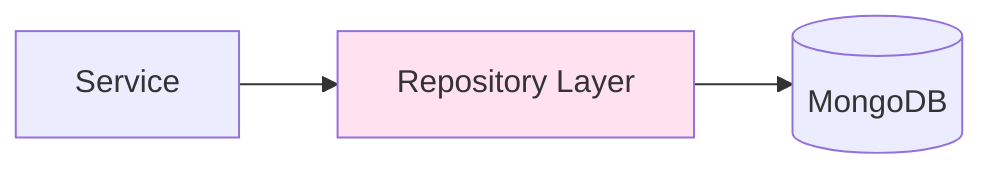

# Node.js Layered Architecture

A demonstration Node.js application showcasing a clean, maintainable layered architecture pattern for building RESTful APIs. This project implements a book management system using Express.js and MongoDB, following separation of concerns and dependency injection principles.

Built as an educational example to demonstrate best practices in Node.js application architecture, including proper separation of controllers, services, repositories, and middleware layers.

## Features

- 📚 RESTful API for book management (CRUD operations)
- 🏗️ Clean layered architecture (Controller → Service → Repository)
- 🔄 Content negotiation (JSON and HTML responses)
- ✅ Input validation using Joi
- 🗄️ MongoDB integration with abstracted data access layer
- 🧪 Comprehensive test suite (unit and component tests)
- 🔍 ESLint with Airbnb configuration
- 💅 Prettier for code formatting
- 🎣 Pre-commit hooks with Husky
- 🖥️ Server-side rendering with Handlebars templates

## Architecture Overview



## Getting Started

### Prerequisites

- Node.js (v12 or higher)
- MongoDB (v3.6 or higher)
- npm or yarn

### Installation

1. Clone the repository:
```bash
git clone https://github.com/orassayag/nodejs-layered-architecture.git
cd nodejs-layered-architecture
```

2. Install dependencies:
```bash
npm install
```

3. Ensure MongoDB is running:
```bash
mongod
```

4. Start the application:
```bash
npm start
```

The server will start on port 3001 (or the port specified in your environment).

### Configuration

Optional environment variables (create a `.env` file):
```env
PORT=3001
MONGODB_URI=mongodb://localhost:27017/books
```

## Available Scripts

### Development
```bash
npm run watch          # Start with hot reload
npm run watch:prod     # Start with hot reload and dotenv
```

### Production
```bash
npm start              # Start the server
npm run start:prod     # Start with environment variables
```

### Testing
```bash
npm test               # Run all tests
npm run test:unit      # Run unit tests only
npm run test:component # Run component/integration tests only
```

### Code Quality
```bash
npm run lint           # Check code for linting errors
```

## API Endpoints

### Books Collection

| Method | Endpoint | Description |
|--------|----------|-------------|
| GET | `/books` | Get all books |
| POST | `/books` | Create or update a book |
| GET | `/books/:isbn` | Get a specific book by ISBN |

### Example Requests

**Get all books:**
```bash
curl http://localhost:3001/books
```

**Create a book:**
```bash
curl -X POST http://localhost:3001/books \
  -H "Content-Type: application/json" \
  -d '{
    "title": "Clean Code",
    "authors": ["Robert C. Martin"],
    "isbn": "9780132350884",
    "description": "A Handbook of Agile Software Craftsmanship"
  }'
```

**Get a specific book:**
```bash
curl http://localhost:3001/books/9780132350884
```

## Project Structure

```
nodejs-layered-architecture/
├── src/
│   ├── controllers/           # HTTP request handlers
│   │   └── bookController.js
│   ├── services/              # Business logic
│   │   └── bookService.js
│   ├── repositories/          # Data access layer
│   │   ├── bookRepository.js
│   │   └── inMemoryBookRepository.js
│   ├── middlewares/           # Express middlewares
│   │   ├── errorMiddleware.js
│   │   ├── layoutMiddleware.js
│   │   └── validateBookMiddleware.js
│   ├── routes/                # Route definitions
│   │   └── bookRoutes.js
│   ├── utils/                 # Utility functions
│   │   ├── makeSlug.js
│   │   └── validateBook.js
│   ├── views/                 # Handlebars templates
│   │   ├── layout.hbs
│   │   ├── books.hbs
│   │   └── book.hbs
│   ├── links/                 # Link/URL helpers
│   │   └── links.js
│   ├── connection.js          # Database connection
│   ├── app.js                 # Express app setup
│   └── server.js              # Server entry point
├── test/
│   ├── unit/                  # Unit tests
│   │   ├── bookControllerTest.js
│   │   └── bookServiceTest.js
│   └── component/             # Integration tests
│       └── bookTest.js
├── CONTRIBUTING.md            # Contribution guidelines
├── INSTRUCTIONS.md            # Detailed instructions
├── LICENSE                    # MIT License
└── package.json
```

## Layered Architecture Explained

### 1. Routes Layer
Entry point for HTTP requests. Defines endpoints and maps them to controllers.

```javascript
router.get(BOOK_COLLECTION, getList);
router.post(BOOK_COLLECTION, validateBookMiddleware, createOrUpdate);
router.get(BOOK, details);
```

### 2. Middleware Layer
Handles cross-cutting concerns: validation, error handling, authentication.

```javascript
validateBookMiddleware  // Input validation
errorMiddleware        // Error handling
layoutMiddleware       // View layout setup
```

### 3. Controller Layer
Handles HTTP concerns: request parsing, response formatting, content negotiation.



```javascript
async getList(req, res) {
  const books = await bookRepository.getList();
  res.format({
    'text/html': () => res.render('books', { books }),
    'application/json': () => res.json(books)
  });
}
```

### 4. Service Layer
Contains business logic, independent of HTTP concerns.



```javascript
createOrUpdate({ title, authors, isbn, description }) {
  const slug = makeSlug(title);  // Business logic
  return bookRepository.createOrUpdate({ title, slug, authors, isbn, description });
}
```

### 5. Repository Layer
Abstracts data access, provides a clean interface for database operations.



```javascript
getList: async () => books.find({}).toArray(),
createOrUpdate: async book => books.updateOne({ isbn: book.isbn }, { $set: book }, { upsert: true }),
findOne: async isbn => books.findOne({ isbn })
```

## Testing

The project includes comprehensive tests:

- **Unit Tests**: Test individual components in isolation
- **Component Tests**: Test the full request/response cycle

Run tests with:
```bash
npm test
```

## Development

The project uses:
- **Express.js** for web framework
- **MongoDB** for database
- **Handlebars** for templating
- **Joi** for validation
- **Mocha** for testing
- **Supertest** for HTTP testing
- **ESLint** for code linting
- **Prettier** for code formatting

## Contributing

Contributions to this project are [released](https://help.github.com/articles/github-terms-of-service/#6-contributions-under-repository-license) to the public under the [project's open source license](LICENSE).

Everyone is welcome to contribute. Contributing doesn't just mean submitting pull requests—there are many different ways to get involved, including answering questions and reporting issues.

Please see [CONTRIBUTING.md](CONTRIBUTING.md) for detailed guidelines.

## Author

* **Or Assayag** - *Initial work* - [orassayag](https://github.com/orassayag)
* Or Assayag <orassayag@gmail.com>
* GitHub: https://github.com/orassayag
* StackOverflow: https://stackoverflow.com/users/4442606/or-assayag?tab=profile
* LinkedIn: https://linkedin.com/in/orassayag

## License

This application has an MIT license - see the [LICENSE](LICENSE) file for details.
