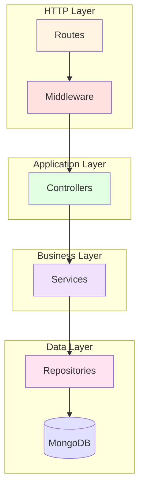
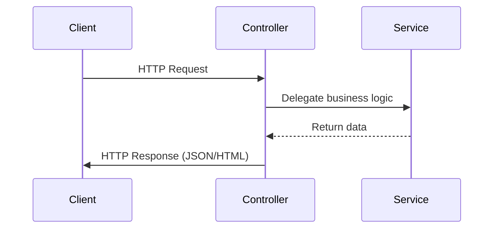

# Node.js Layered Architecture Example

A comprehensive demonstration of clean layered architecture pattern in Node.js, showcasing best practices for building maintainable and testable RESTful APIs.

## Architecture Overview

This example implements a complete book management system with proper separation of concerns:



## Key Features

- ✅ Clean separation of concerns (Routes → Middleware → Controller → Service → Repository)
- ✅ Dependency injection for testability
- ✅ Content negotiation (JSON/HTML)
- ✅ Input validation with Joi
- ✅ Comprehensive error handling
- ✅ Unit and component tests
- ✅ ESLint + Prettier configuration
- ✅ Pre-commit hooks with Husky

## Quick Start

```bash
npm install
npm start
```

The server will start on http://localhost:3001

## Layers Explained

### 1. Routes (`src/routes/`)
Defines HTTP endpoints and maps them to controllers:

```javascript
router.get('/books', getList);
router.post('/books', validateBookMiddleware, createOrUpdate);
router.get('/books/:isbn', details);
```

### 2. Middleware (`src/middlewares/`)
Handles cross-cutting concerns:
- **validateBookMiddleware.js** - Input validation using Joi
- **errorMiddleware.js** - Centralized error handling
- **layoutMiddleware.js** - View layout configuration

### 3. Controllers (`src/controllers/`)
Handles HTTP concerns only (request/response):



```javascript
async getList(req, res) {
  const books = await bookRepository.getList();
  res.format({
    'text/html': () => res.render('books', { books }),
    'application/json': () => res.json(books)
  });
}
```

### 4. Services (`src/services/`)
Contains business logic, independent of HTTP:

```javascript
createOrUpdate({ title, authors, isbn, description }) {
  const slug = makeSlug(title);  // Business logic here
  return bookRepository.createOrUpdate({
    title, slug, authors, isbn, description
  });
}
```

### 5. Repositories (`src/repositories/`)
Abstracts data access:

```javascript
module.exports = db => ({
  getList: async () => books.find({}).toArray(),
  createOrUpdate: async book => books.updateOne(
    { isbn: book.isbn }, 
    { $set: book }, 
    { upsert: true }
  ),
  findOne: async isbn => books.findOne({ isbn })
});
```

## API Endpoints

| Method | Endpoint | Description |
|--------|----------|-------------|
| GET | `/books` | List all books |
| POST | `/books` | Create/update a book |
| GET | `/books/:isbn` | Get book by ISBN |

### Example Usage

**Create a book:**
```bash
curl -X POST http://localhost:3001/books \
  -H "Content-Type: application/json" \
  -d '{
    "title": "Clean Code",
    "authors": ["Robert C. Martin"],
    "isbn": "9780132350884",
    "description": "A Handbook of Agile Software Craftsmanship"
  }'
```

**Get all books (JSON):**
```bash
curl -H "Accept: application/json" http://localhost:3001/books
```

**Get all books (HTML):**
```bash
curl -H "Accept: text/html" http://localhost:3001/books
```

## Testing

```bash
npm test              # Run all tests
npm run test:unit     # Unit tests only
npm run test:component # Integration tests only
```

## Code Quality

```bash
npm run lint          # Check code style
```

## Project Structure

```
src/
├── controllers/      # HTTP handlers
├── services/         # Business logic
├── repositories/     # Data access
├── middlewares/      # Express middleware
├── routes/          # Route definitions
├── utils/           # Helper functions
├── views/           # Handlebars templates
├── links/           # URL helpers
├── connection.js    # DB connection
├── app.js           # Express setup
└── server.js        # Entry point

test/
├── unit/            # Unit tests
└── component/       # Integration tests
```

## Technologies

- **Express.js** - Web framework
- **MongoDB** - Database
- **Handlebars** - Templating
- **Joi** - Validation
- **Mocha** - Test framework
- **Supertest** - HTTP testing

## License

MIT
